<h2>TensorFlow-FlexUNet-Image-Segmentation-Foveal-Avascular-Zone (2025/06/28)</h2>

This is the first experiment of Image Segmentation for Foveal-Avascular-Zone (FAZ)
 based on 
our <a href="https://github.com/sarah-antillia/TensorFlow-FlexUNet-Image-Segmentation-Model">TensorFlow FlexUNet Model</a>
 (<b>TensorFlow Flexible UNet Image Segmentation Model for Multiclass</b>) and a 512x512 pixels PNG
 <a href="https://drive.google.com/file/d/1Q3Ds-EvpiTWQCExFzcY3DE-kciSLswX1/view?usp=sharing">
Foveal-Avascular-Zone-ImageMask-Dataset.zip</a> with colorized masks 
(<a href="https://creativecommons.org/licenses/by/4.0/legalcode">Creative Commons Attribution 4.0 International</a>
), which was derived by us from:  
<a href="https://zenodo.org/records/5075194">
<b>OCTA imsges dataset with pixel-level mask annotaion for FAZ segmentation</b></a>
  

<b>Actual Image Segmentation for Foveal-Avascular-Zone Images of 512x512 pixels</b> 
As shown below, the inferred masks look similar to the ground truth masks.   
<b>class_color_map = {Deep:yellow, Superficial:mazenta} </b>. 
 
<table>
<tr>
<th>Input: image</th>
<th>Mask (ground_truth)</th>
<th>Prediction: inferred_mask</th>
</tr>
<tr>
<td>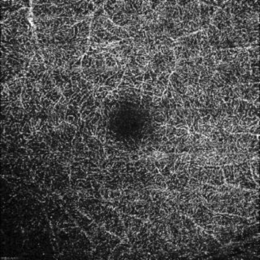</td>
<td>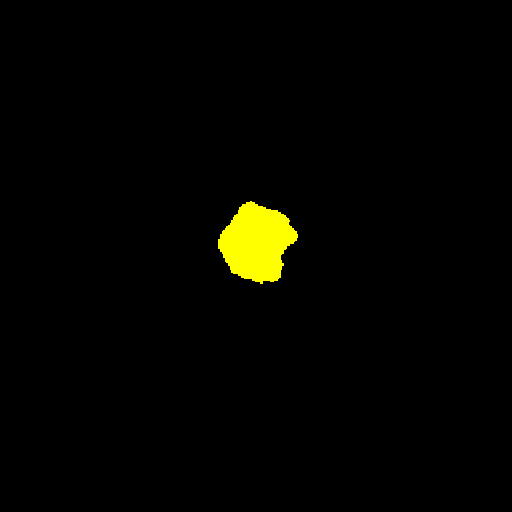</td>
<td></td>
</tr>

<tr>
<td>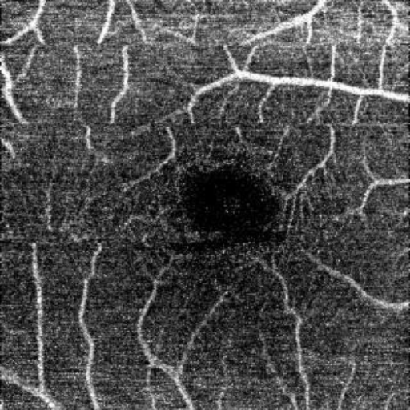</td>
<td>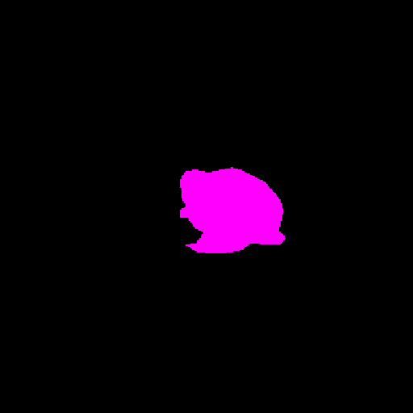</td>
<td>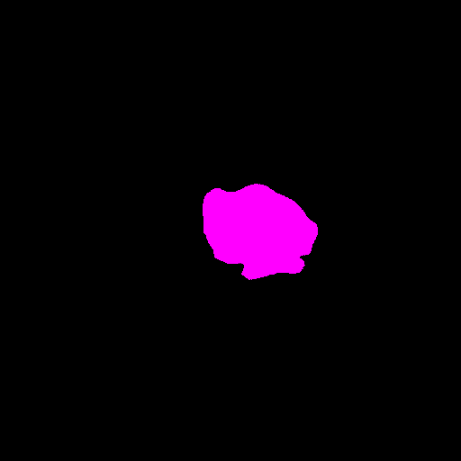</td>
</tr>

<tr>
<td>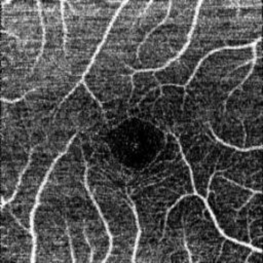</td>
<td></td>
<td>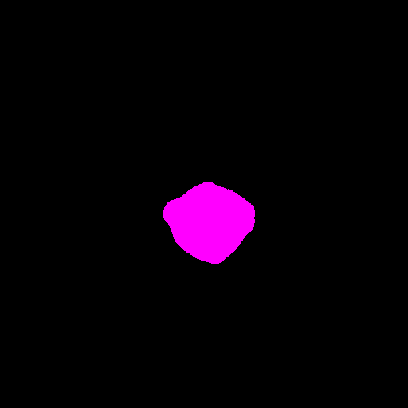</td>
</tr>
</table>

 
<h3>1. Dataset Citation</h3>
The dataset used here was derived from:   
<a href="https://zenodo.org/records/5075194">
<b>OCTA imsges dataset with pixel-level mask annotaion for FAZ segmentation</b></a>
  
The following explanation was taken from the above web site.  
This dataset is the affiliated data for the reaserch "A Deep Learning-based Quality 
Assessment and Segmentation System and A Large Benchmark Datatset for Optical Coherence Tomographic Angiography Image"
  
<b>Detail</b> 
This dataset is the pixel-level mask annotaion for FAZ segmentation. 1,101 3 × 3 mm2 sOCTA images chosen from gradable and best OCTA images randomly in 
subset sOCTA-3x3-10k, and 1,143 3 × 3 mm2dOCTA images were annotated by an experienced ophthalmologist.
 
 
<b>Citation</b> 
Yufei Wang, Yiqing Shen, Meng Yuan, Jing Xu, Wei Wang, & Weijing Cheng. (2021). 
OCTA imsges dataset with pixel-level mask annotaion for FAZ segmentation (1.0) 
[Data set]. Zenodo. https://doi.org/10.5281/zenodo.5075194
  
<b>License</b> 
<a href="https://creativecommons.org/licenses/by/4.0/legalcode">Creative Commons Attribution 4.0 International</a>
  
<h3>
2 Foveal-Avascular-Zone-Images ImageMask Dataset
</h3>
 If you would like to train this Foveal-Avascular-Zone-Images Segmentation model by yourself,
 please download the dataset from the google drive  
 <a href="https://drive.google.com/file/d/1Q3Ds-EvpiTWQCExFzcY3DE-kciSLswX1/view?usp=sharing">
Foveal-Avascular-Zone-ImageMask-Dataset.zip</a> with colorized masks 
(<a href="https://creativecommons.org/licenses/by/4.0/legalcode">Creative Commons Attribution 4.0 International</a>
)
, expand the downloaded ImageMaskDataset and put it under <b>./dataset</b> folder to be
 
<pre>
./dataset
└─Foveal-Avascular-Zone
    ├─test
    │   ├─images
    │   └─masks
    ├─train
    │   ├─images
    │   └─masks
    └─valid
        ├─images
        └─masks
</pre>
 
<b>Foveal-Avascular-Zone-Images Statistics</b> 
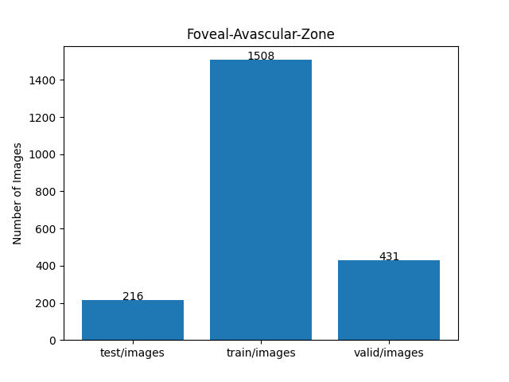 
 
As shown above, the number of images of train and valid datasets is not so large to use for the
 training set of our segmentation model.
 
 
<b>Train_images_sample</b> 
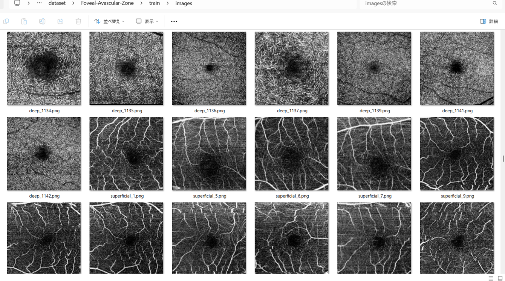
 
<b>Train_masks_sample</b> 
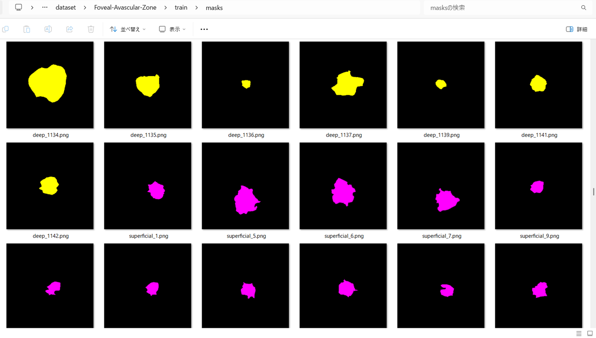
 

<h3>
3 Train TensorFlowFlexUNet Model
</h3>
 We trained Foveal-Avascular-Zone-Images TensorFlowFlexUNet Model by using the following
<a href="./projects/TensorFlowFlexUNet/Foveal-Avascular-Zone/train_eval_infer.config"> <b>train_eval_infer.config</b></a> file.  
Please move to ./projects/TensorFlowFlexUNet/Foveal-Avascular-Zone-Images and run the following bat file. 
<pre>
>1.train.bat
</pre>
, which simply runs the following command. 
<pre>
>python ../../../src/TensorFlowFlexUNetTrainer.py ./train_eval_infer.config
</pre>

<b>Model parameters</b> 
Defined a small <b>base_filters=16 </b> and large <b>base_kernels=(11,11)</b> for the first Conv Layer of Encoder Block of 
<a href="./src/TensorFlowFlexUNet.py">TensorFlowFlexUNet.py</a> 
and a large <b>num_layers=8</b> (including a bridge between Encoder and Decoder Blocks).
<pre>
[model]
;You may specify your own UNet class derived from our TensorFlowFlexModel
model         = "TensorFlowFlexUNet"
generator     =  False
image_width    = 512
image_height   = 512
image_channels = 3
input_normalize = True
normalization  = False
num_classes    = 3
base_filters   = 16
base_kernels   = (11,11)
num_layers     = 8
dropout_rate   = 0.04
dilation       = (1,1)
</pre>
<b>Learning rate</b> 
Defined a small learning rate.  
<pre>
[model]
learning_rate  = 0.00007
</pre>
<b>Loss and metrics functions</b> 
Specified "categorical_crossentropy" and <a href="./src/dice_coef_multiclass.py">"dice_coef_multiclass"</a>. 
<pre>
[model]
loss           = "categorical_crossentropy"
metrics        = ["dice_coef_multiclass"]
</pre>
<b>Dataset class</b> 
Specifed <a href="./src/ImageCategorizedMaskDataset.py">ImageCategorizedMaskDataset</a> class. 
<pre>
[dataset]
class_name    = "ImageCategorizedMaskDataset"
</pre>
 
<b>Learning rate reducer callback</b> 
Enabled learing_rate_reducer callback, and a small reducer_patience.
<pre> 
[train]
learning_rate_reducer = True
reducer_factor     = 0.4
reducer_patience   = 4
</pre>
<b>Early stopping callback</b> 
Enabled early stopping callback with patience parameter.
<pre>
[train]
patience      = 10
</pre>

<b>RGB Color map</b> 
Specifed rgb color map dict for Foveal-Avascular-Zone-Images 3 classes. 
<pre>
[mask]
mask_datatype= "categorized"
mask_file_format = ".png"
mask_datatyoe    = "categorized"
;Foveal-Avascular-Zone-Images rgb color map dict for 1+2 classes.
;                    Deep:yellow, Superficial:mazenta 
rgb_map = {(0,0,0):0,(255,255,0):1,(255,0,255):2}
</pre>

<b>Epoch change inference callback</b> 
Enabled <a href="./src/EpochChangeInferencer.py">epoch_change_infer callback</a></b>. 
<pre>
[train]
epoch_change_infer       = True
epoch_change_infer_dir   =  "./epoch_change_infer"
num_infer_images         = 6
</pre>

By using this callback, on every epoch_change, the inference procedure can be called
 for 6 images in <b>mini_test</b> folder. This will help you confirm how the predicted mask changes 
 at each epoch during your training process.  
  
As shown below, early in the model training, the predicted masks from our UNet segmentation model showed 
discouraging results.
 However, as training progressed through the epochs, the predictions gradually improved. 
   
 
<b>Epoch_change_inference output at starting (epoch 1,2,3)</b> 
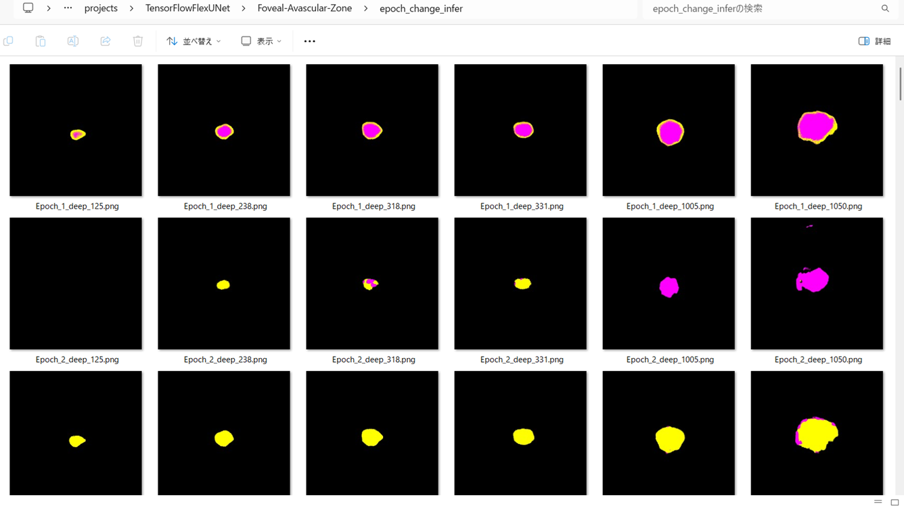 
 
<b>Epoch_change_inference output at middlepoint (epoch 16,17,18)</b> 
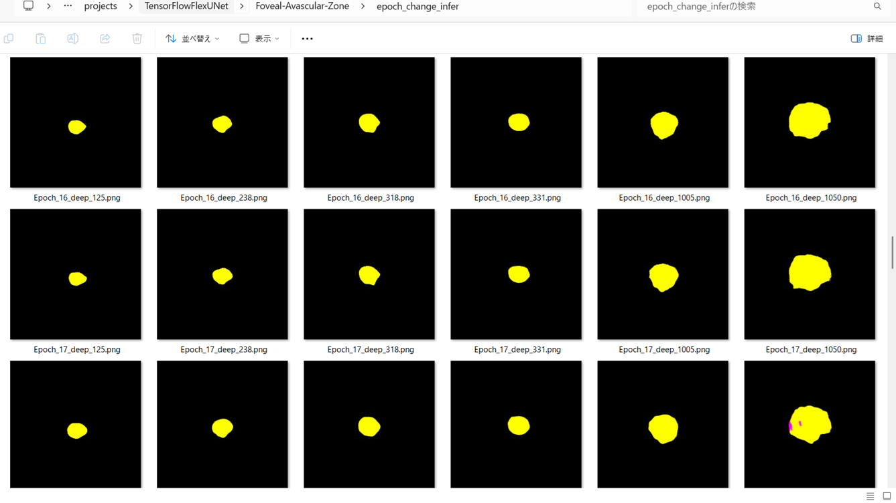 
 
<b>Epoch_change_inference output at ending (epoch 34,35,36)</b> 
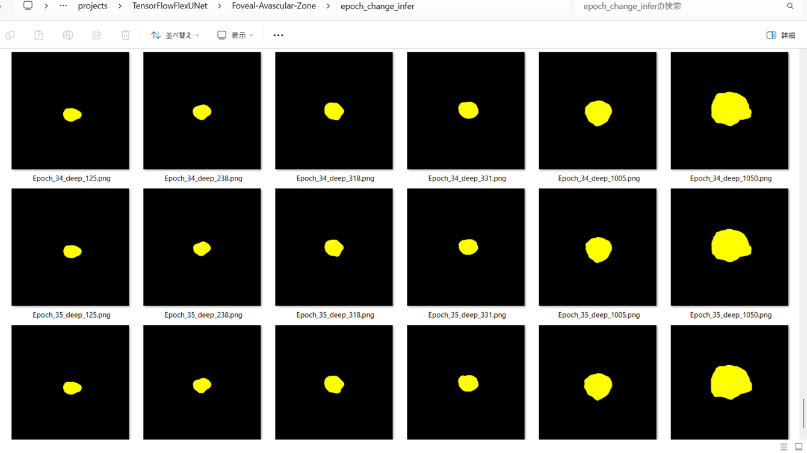 
 

In this experiment, the training process was stopped at epoch 36 by EarlyStopping callback.  
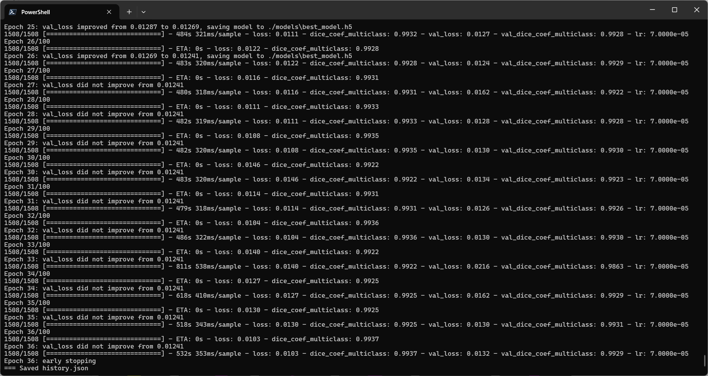 
 

<a href="./projects/TensorFlowFlexUNet/Foveal-Avascular-Zone/eval/train_metrics.csv">train_metrics.csv</a> 
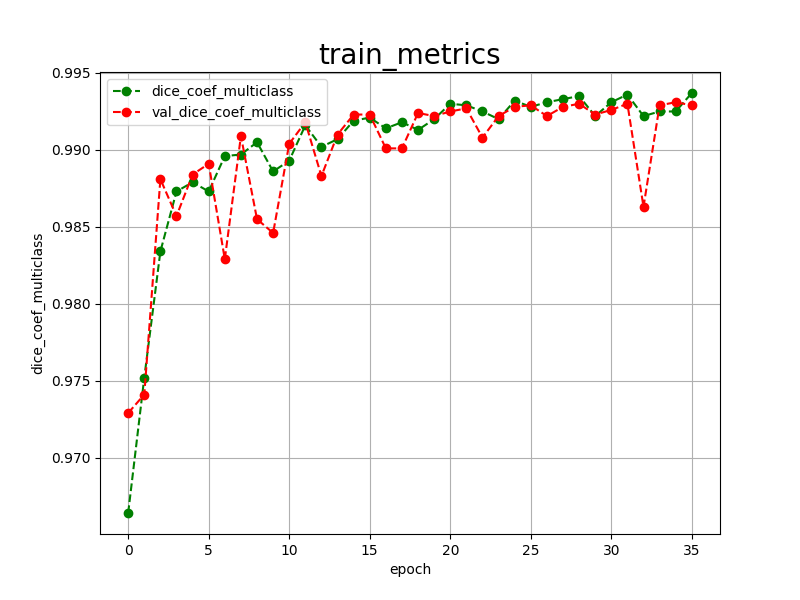 

 
<a href="./projects/TensorFlowFlexUNet/Foveal-Avascular-Zone/eval/train_losses.csv">train_losses.csv</a> 
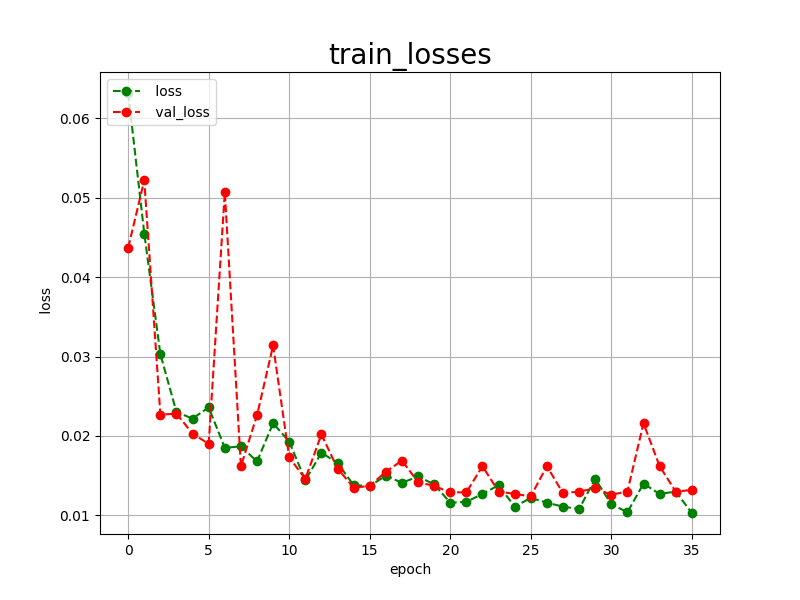 

 

<h3>
4 Evaluation
</h3>
Please move to <b>./projects/TensorFlowFlexUNet/Foveal-Avascular-Zone-Images</b> folder, 
and run the following bat file to evaluate TensorFlowUNet model for Foveal-Avascular-Zone-Images. 
<pre>
./2.evaluate.bat
</pre>
This bat file simply runs the following command.
<pre>
python ../../../src/TensorFlowFlexUNetEvaluator.py ./train_eval_infer_aug.config
</pre>

Evaluation console output: 
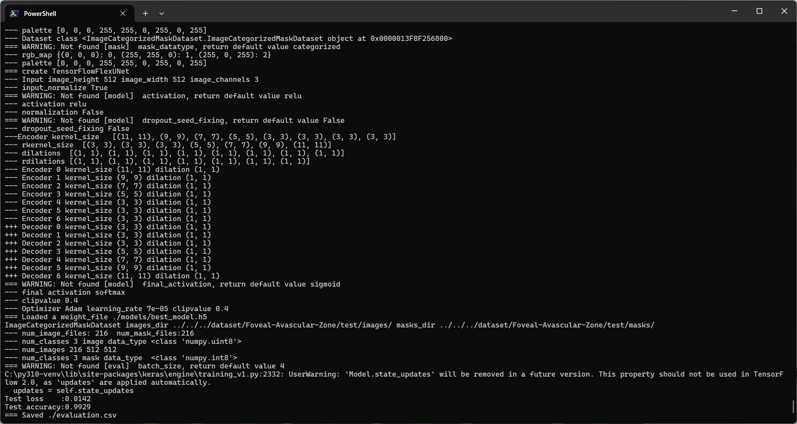
  Image-Segmentation-Foveal-Avascular-Zone-Images

<a href="./projects/TensorFlowFlexUNet/Foveal-Avascular-Zone/evaluation.csv">evaluation.csv</a> 
The loss (categorical_crossentropy) to this Foveal-Avascular-Zone-Images/test was low, and dice_coef_multiclass 
was high as shown below.
 
<pre>
categorical_crossentropy,0.0142
dice_coef_multiclass,0.9929
</pre>
 

<h3>
5 Inference
</h3>
Please move to a <b>./projects/TensorFlowFlexUNet/Foveal-Avascular-Zone-Images</b> folder 
,and run the following bat file to infer segmentation regions for images by the Trained-TensorFlowUNet model for Foveal-Avascular-Zone-Images. 
<pre>
./3.infer.bat
</pre>
This simply runs the following command.
<pre>
python ../../../src/TensorFlowFlexUNetInferencer.py ./train_eval_infer_aug.config
</pre>

<b>mini_test_images</b> 
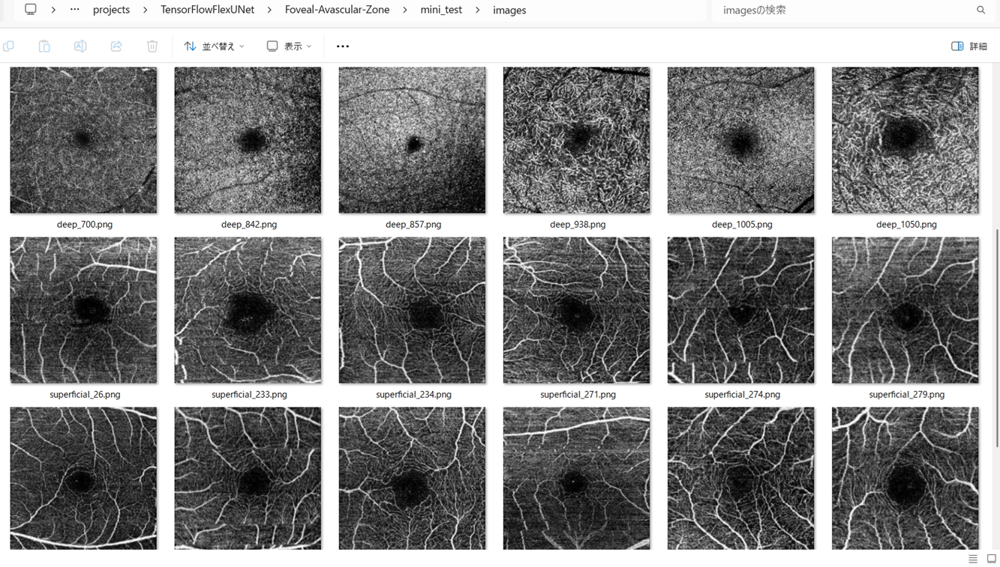 
<b>mini_test_mask(ground_truth)</b> 
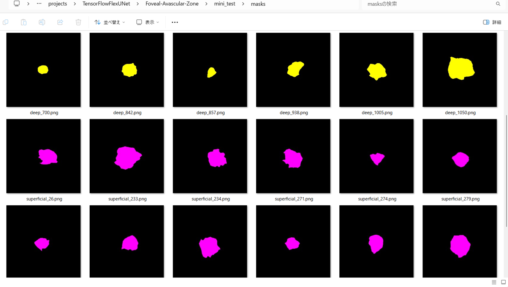 

<b>Inferred test masks</b> 
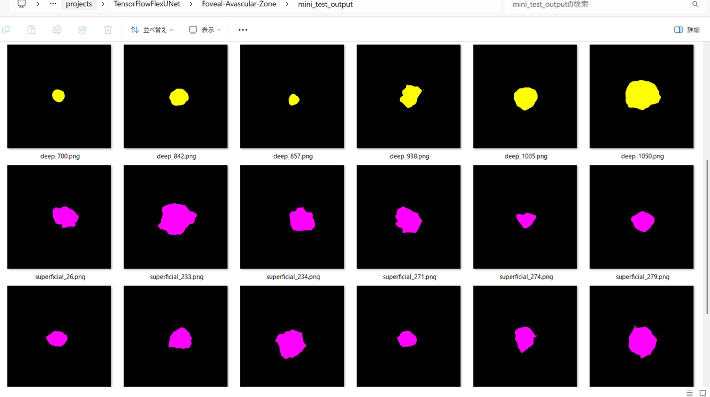 
 

<b>Enlarged images and masks of Foveal-Avascular-Zone Images of 512x512 pixels</b>  
<b>class_color_map = {Deep:yellow, Superficial:mazenta} </b>.  
<table>
<tr>
<th>Image</th>
<th>Mask (ground_truth)</th>
<th>Inferred-mask</th>
</tr>
<tr>
<td>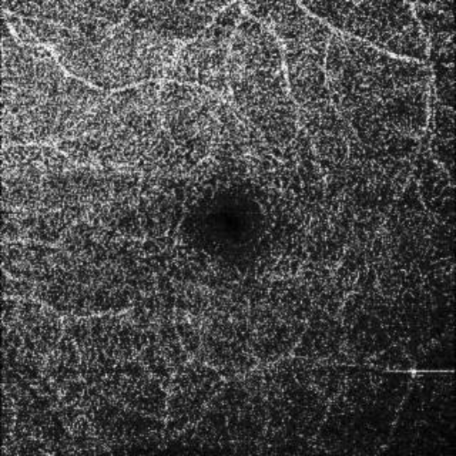</td>
<td>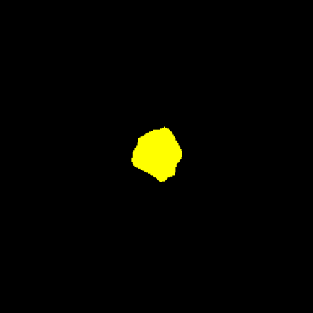</td>
<td>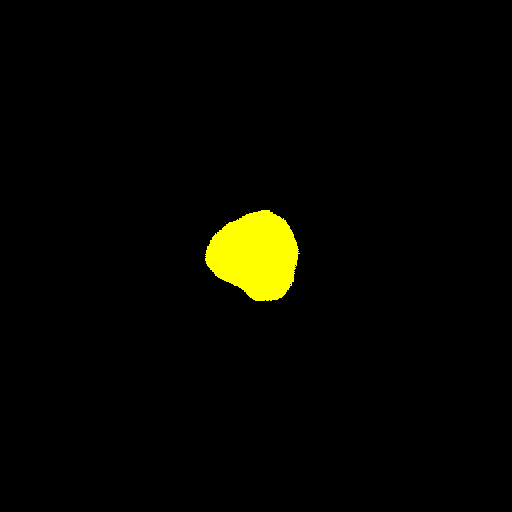</td>
</tr>

<tr>
<td>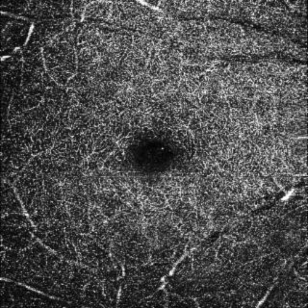</td>
<td>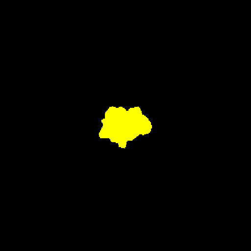</td>
<td>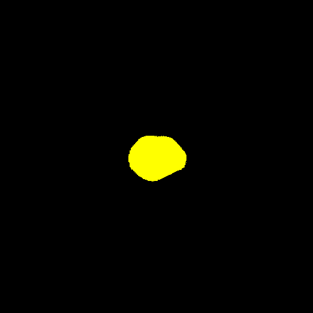</td>
</tr>

<tr>
<td>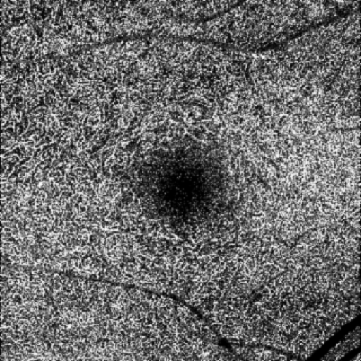</td>
<td>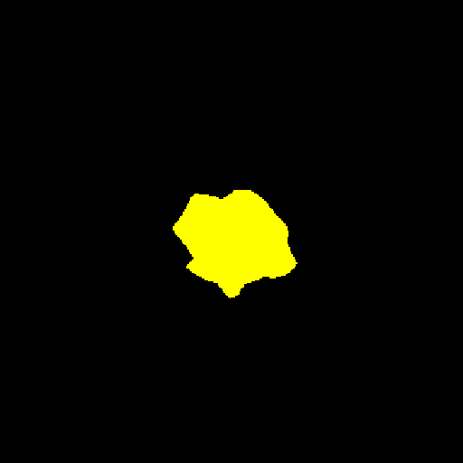</td>
<td>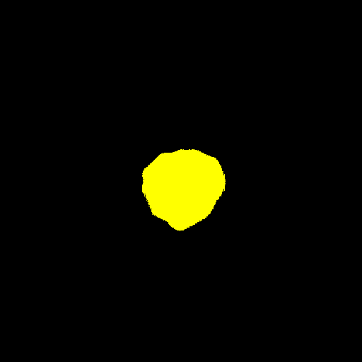</td>
</tr>

<tr>
<td>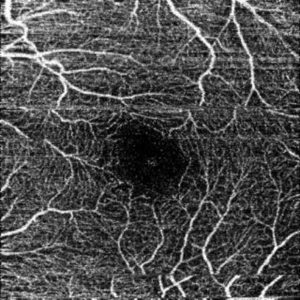</td>
<td>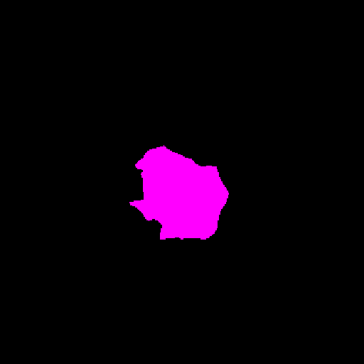</td>
<td></td>
</tr>

<tr>
<td></td>
<td></td>
<td></td>
</tr>

<tr>
<td>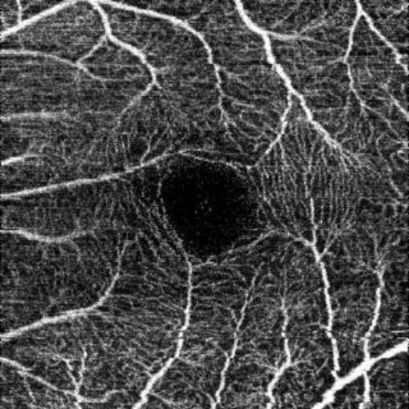</td>
<td>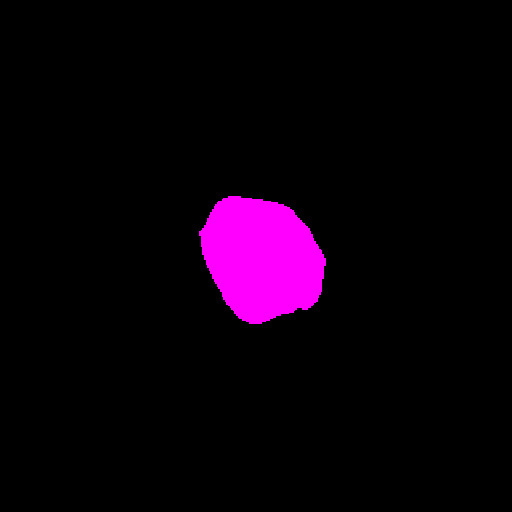</td>
<td></td>
</tr>
</table>

 
<h3>
References
</h3>
<b>1. Application of Improved U-Net Convolutional Neural Network 
for Automatic Quantification of the Foveal Avascular Zone in Diabetic Macular Ischemia</b> 
Yongan Meng, Hailei Lan, Yuqian Hu, Zailiang Chen, Pingbo Ouyang, Jing Luo 
<a href="https://pmc.ncbi.nlm.nih.gov/articles/PMC8898103/">https://pmc.ncbi.nlm.nih.gov/articles/PMC8898103/</a>
  
<b>2. TensorFlow-FlexUNet-Image-Segmentation-Model</b> 
Toshiyuki Arai @antillia.com 
<a href="https://github.com/sarah-antillia/TensorFlow-FlexUNet-Image-Segmentation-Model">
https://github.com/sarah-antillia/TensorFlow-FlexUNet-Image-Segmentation-Model</a>
 
 
